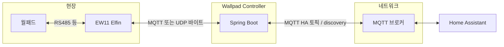
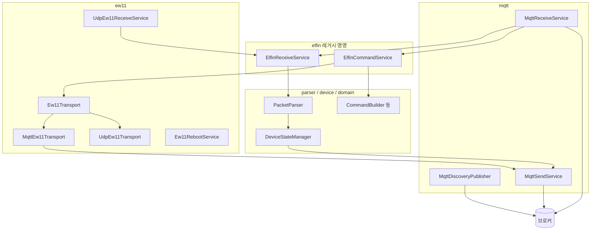

# 아키텍처

## 시스템 컨텍스트

월패드(RS485 등)는 EW11이 중계하고, 본 앱은 EW11과 **MQTT 토픽** 또는 **UDP 소켓**으로 raw 바이트를 주고받습니다. HA와의 연동은 **항상 MQTT**입니다.

## 논리 구조 (패키지 역할)

- **ew11**: EW11으로 나가는 바이트(`Ew11Transport`)와, UDP 모드일 때 들어오는 수신 스레드(`UdpEw11ReceiveService`). 선택적으로 HTTP로 EW11 재부팅(`Ew11RebootService`).
- **elfin**: 이름은 애드온 계열과의 호환을 연상시키지만, 실질적으로 **EW11 수신 처리**(RX)와 **HA 명령 → 패킷 송신**(CMD) 진입점입니다.
- **mqtt.receive**: 브로커 콜백. 토픽에 따라 EW11 수신 분기 또는 HA `command` 처리.
- **mqtt.sender**: HA 상태·discovery·EW11 send 토픽 등 publish.
- **parser / device / domain**: 패킷 해석, 기기 엔티티, 명령 빌드, H2 JPA.

## EW11 전송 모드 분기

`ew11.transport` 값에 따라 스프링이 다른 빈을 활성화합니다.

| 모드 | EW11 수신 | EW11 송신 |
|------|-------------|-------------|
| `mqtt` (기본) | `MqttReceiveService`가 `receive-topic` 구독 → `ElfinReceiveService` | `MqttEw11Transport` → `send-topic` |
| `udp` | `UdpEw11ReceiveService`가 로컬 UDP 포트 수신 → `ElfinReceiveService` | `UdpEw11Transport` → 설정된 호스트·포트 |

MQTT 모드에서도 **HA용 브로커**는 동일 클라이언트를 쓰며, EW11용 토픽과 HA 토픽을 함께 구독합니다.

## 기동 시 DB 초기화

`StartUpRunner`가 `device_type` 테이블 row 수를 보고, 비어 있으면 클래스패스의 `commax-initial.sql`을 실행합니다. 이후 재기동 시에는 스킵됩니다.
