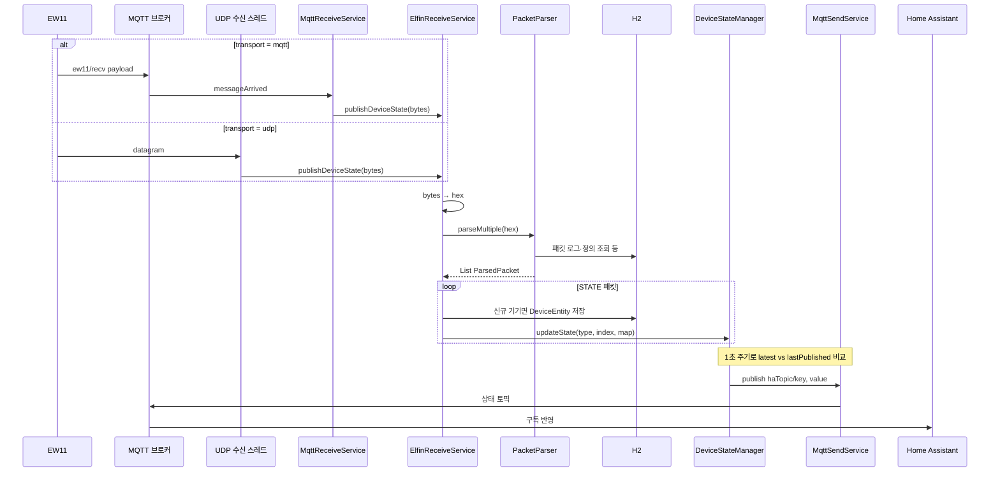
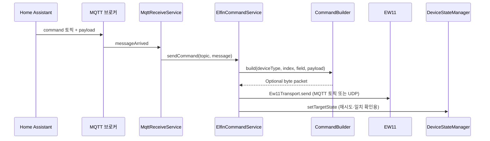

# 데이터 흐름

## 1) 월패드 → EW11 → 앱 → 파싱 → HA 상태

바이트 스트림이 들어오면 HEX 문자열로 바꾼 뒤 `PacketParser`가 여러 패킷으로 쪼개 해석합니다. `PacketKind.STATE`인 경우에만 기기 등록·상태 갱신·MQTT 발행 루프에 태웁니다.

`ElfinReceiveService` 기동 시 `{haTopic}/status`에 `online`(retain)을 한 번 올리고, 종료 시 `offline`을 publish합니다.

## 2) HA → MQTT command → 앱 → EW11

HA(또는 테스트 클라이언트)가 `{mqtt.ha-topic}/command/...`에 payload를 보냅니다. 토픽에서 기기 타입·인덱스·필드를 파싱해 `CommandBuilder`로 바이트 패킷을 만든 뒤 `Ew11Transport.send`로 EW11에 넘깁니다.

명령 후 실제 월패드 상태가 돌아오면 1)번 흐름으로 `DeviceStateManager`의 `latestState`가 갱신되고, 목표값과 맞으면 재시도 항목이 정리됩니다.

## Discovery (요약)

`MqttDiscoveryPublisher`가 DB에 있는 `DeviceEntity` 목록을 읽어 `homeassistant/...` 형태의 discovery JSON을 publish합니다. HA가 MQTT 통합으로 이를 소비합니다.
