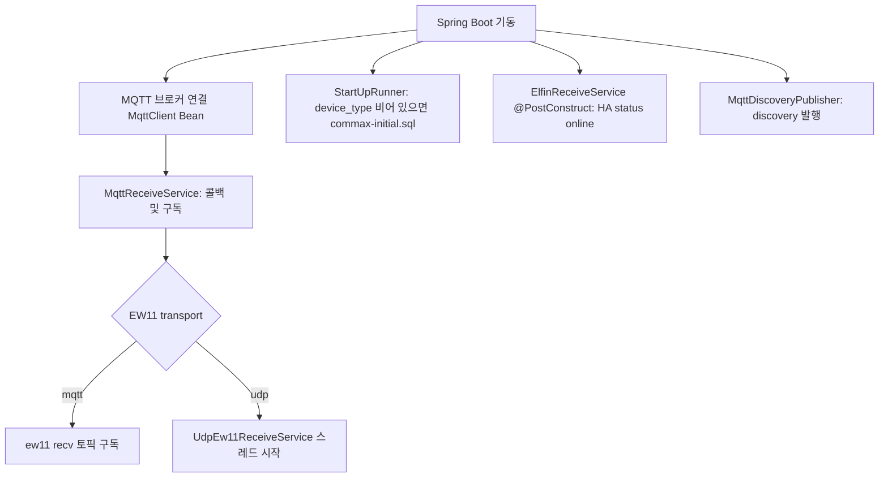

# 운영 및 내장 웹 UI

## 기동 순서 (개념)

- MQTT 연결이 끊기면 `MqttReceiveService.connectionLost`에서 재연결 후 구독을 다시 잡습니다.
- 최초 DB가 비어 `commax-initial.sql`이 돌아간 직후, README에 안내된 것처럼 **한 번 컨테이너를 재시작**하는 운용이 권장됩니다.

## 내장 HTTP (기본 포트 8080)

컨트롤러 기준 경로입니다.

| 경로 | 설명 |
|------|------|
| `GET /` | 패킷 커버리지 대시보드 (`coverage.html`, 클라이언트 렌더) |
| `GET /api/coverage` | 커버리지 JSON (`INBOUND` seen_packet 메모리 기반) |
| `GET /seen-packets` | 관측된 유니크 패킷 목록 (`seen-packets.html`) |
| `GET /api/seen-packets` | 관측 패킷 JSON (메모리 페이징, `direction=INBOUND|OUTBOUND` 필터 지원) |
| `GET /packet-capture` | 실시간 패킷 캡처 UI (DB 저장 없음, SSE) |
| `GET /packet-verify` | 입력 HEX 패턴 일치 시 마지막 수신 시각 모니터 (SSE) |
| `POST /capture/start` | 캡처 시작 |
| `POST /capture/stop` | 캡처 중지 |
| `GET /capture/events` | SSE 이벤트 스트림 |

Docker 사용 시 보통 `52394:8080` 형태로 노출합니다.

## 로그로 확인할 만한 지점

- EW11 MQTT: `MQTT 구독 완료: ew11/recv` (토픽은 설정에 따라 다름)
- EW11 UDP: `EW11 UDP 수신 시작`, `EW11 UDP 송신 초기화 완료`
- 기기 자동 등록: `ElfinReceiveService`의 `등록된 새 기기` 로그
- HA 명령: `ElfinCommandService`의 `HA 명령 수신`, 생성된 HEX 패킷 로그
